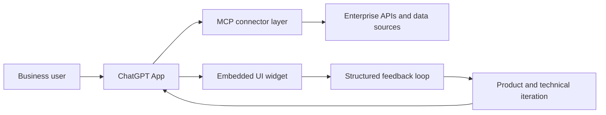

# Enterprise ChatGPT Apps Portfolio

> Turns the process of building internal ChatGPT Apps into a product case study: user discovery, workflow definition, MCP/API integration, testing, and feedback loops.

## Product Impact

The project was part of an internal AI adoption initiative focused on building ChatGPT-based applications for business users. The objective was not only to expose APIs to ChatGPT, but to turn complex internal workflows into usable conversational tools with the right permissions, context, UX, and feedback loops.

My contribution sat between product discovery, business analysis, user testing, and technical delivery. I worked with internal stakeholders to understand their needs and pain points, translated those needs into app behavior and acceptance criteria, and collaborated with the technical team to iterate the solutions until they were useful in real working contexts.

## Functional Flow

## Featured Workstreams

| Workstream | What It Enabled | My Contribution |
| --- | --- | --- |
| Market Research Assistant | Helped users explore brand tracker and survey-style insights through guided conversational analysis. | Participated in end-to-end definition, user validation, test conversations, expected output design, and iteration with stakeholders. |
| Service Operations Assistant | Helped users search, contextualize, and analyze service-management information through a ChatGPT app connected to operational records. | Worked on user needs discovery, app behavior definition, feedback sessions, and alignment between business expectations and technical implementation. |
| In-Chat Feedback Widget | Created a reusable mechanism for users to report app issues, missing functionality, data-quality concerns, and improvement ideas from inside the chat. | Proposed the feedback pattern as a reusable skill/widget concept and helped shape how it should capture structured context for the team. |

## My Role

I acted as the connection point between business users and the technical team:

- Identified user needs, desired outcomes, and adoption blockers through continuous meetings.
- Converted business questions into clear functional requirements and testable app behavior.
- Supported the technical team by clarifying edge cases, terminology, and workflow priorities.
- Ran feedback sessions with users to validate whether the app responses were useful, understandable, and aligned with real work.
- Helped define a reusable feedback mechanism so each app could improve from user input after launch.

## Code And Installation

This repository does not include company code, credentials, internal URLs, datasets, screenshots, or proprietary implementation details. It is a structured, anonymized explanation of the project idea and my contribution.

- [Case Studies](docs/case-studies.md): the three project examples explained as portfolio-ready case studies.
- [My Role and Impact](docs/my-role-and-impact.md): how I contributed across discovery, delivery, testing, and adoption.
- [Feedback Widget Concept](docs/feedback-widget-concept.md): the reusable feedback pattern and why it matters.
- [Anonymization Notes](docs/anonymization-notes.md): what has been intentionally removed or generalized.

## Skills Demonstrated

- Business analysis for AI products
- Stakeholder discovery and requirement translation
- ChatGPT App and MCP connector product thinking
- User acceptance testing and iterative feedback loops
- Cross-functional collaboration with engineering teams
- Designing adoption-oriented AI workflows for enterprise users

## Portfolio Summary

This project shows how I contribute to AI products beyond implementation alone: by understanding the user problem, helping shape the app experience, validating behavior with stakeholders, and creating feedback loops that make internal AI tools more useful and sustainable over time.
