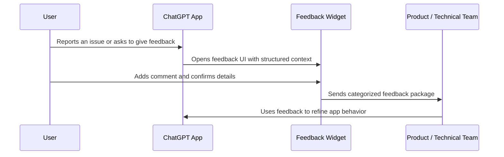
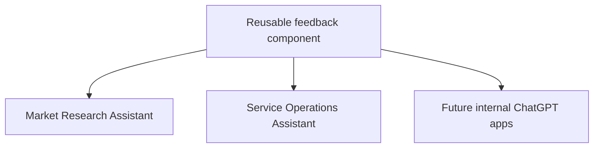

# Feedback Widget Concept

## Problem

Internal AI apps improve fastest when users can report problems at the exact moment they happen. Without an embedded feedback flow, important context is often lost:

- What did the user ask?
- What did the app return?
- What was expected instead?
- Which record, dataset, or business area was affected?
- Was the issue about data quality, scope, format, or missing functionality?

## Proposed Solution

Create a reusable feedback widget that can be triggered inside any ChatGPT app when the user wants to report an issue or suggest an improvement.

The widget should collect a short visible comment from the user while preserving structured context that helps the product and technical teams understand the issue.

## Feedback Data Model

The feedback pattern can capture:

- User comment
- Feedback category
- Severity
- Expected behavior
- Actual behavior
- Steps to reproduce
- Related records or entities
- Chat context
- Conversation share link when available

## Why It Matters

The widget turns user feedback into an operational product loop. It helps the team avoid vague feedback, reproduce issues more quickly, and prioritize improvements based on real usage.

For enterprise ChatGPT apps, this is especially important because user trust depends on the quality, clarity, and reliability of responses over time.

## Reusability

The feedback flow should be designed once and adapted across apps. Each connector can customize labels, categories, or submission destinations, while keeping the same core pattern:

## My Contribution

I proposed this reusable feedback skill/widget idea after seeing the need for a more systematic way to capture user reactions during app testing and adoption.

The value of the idea was not only the widget itself, but the operating model behind it: every app should include a mechanism for learning from users after launch.
